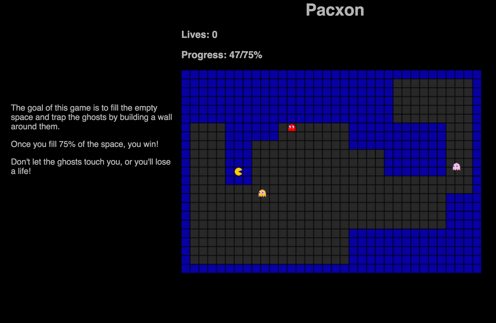

# Pacxon

[Pacxon live](https://aliciasavelly.github.io/Pacxon/)

Pacxon is a combination of two retro games: Pacman and Xonix. Game play is more similar to Xonix, but it has a look and feel closer to Pacman, because it includes the Pacman characters. Pacxon is a one player game on a rectangular grid. Blocks on the grid are toggled in and out of view, and the pacman ghosts bounce off of the blocks when they're toggled into view.

## How to play the game

The game follows these simple rules:

1. The pacman character moves through the grid, and if it makes it to an already formed block (start of game has blocks as the border), the spaces the pacman moves through also turn into blocks.

2. If while the pacman character is making blocks, there is an open area with no ghosts, that area also gets filled with blocks.

3. While the pacman character is moving through the grid, trying to create blocks, if a ghost runs into the pacman or the spaces with soon-to-be blocks, the pacman loses a life and the blocks aren't created. The pacman restarts at the top corner.

4. Once the blocks take up 80% or more of the grid, the user wins that level.

5. Once the lives are up, the game is lost. In my implementation, players will be able to continue at the same level, but the grid will reset with blocks only as a border.

## Future Directions

I plan on continuing work on this project. Below is an outline of the features I plan on implementing.=

### Collisions

Collisions are not working as well as I would like them to. I will fix the bugs that happen every so often with collisions.

### Ghosts

Ghosts do the same things now, but they will have different abilities (e.g., moving fasters, etc.).

### More levels

Each new level should bring new challenges, and users should be able to see which level they have gotten to.

### Power ups

Power ups would make the game experience more varied for players. Adding a few of these would make game play more interesting.

### Music

I plan on adding some classic Pacman music here, and allowing users to mute it easily.
